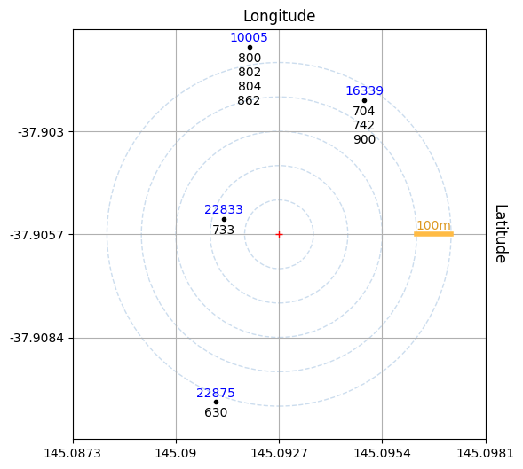
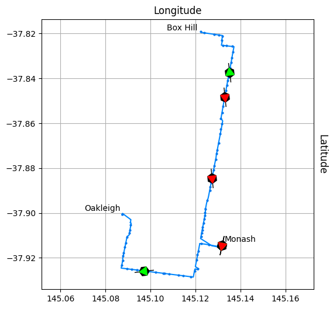

# Public Transport Victoria (PTV) Timetable API v3
The [PTV Timetable API](https://www.ptv.vic.gov.au/footer/data-and-reporting/datasets/ptv-timetable-api/) provides programmatic access to public transport data for the state of Victoria, Australia.

Here's a [minimal implementation](https://github.com/r1cc4rdo/PTV_v3/blob/main/ptvv3.py) with no dependencies:
``` python
import requests
import hashlib
import hmac

class PTVv3:    
    base_url = 'https://timetableapi.ptv.vic.gov.au'

    def __init__(self, ptv_id, ptv_key):
        self.id = ptv_id
        self.key = ptv_key.encode('utf-8')

    def __call__(self, endpoint, **params):
        params['devid'] = self.id
        request = f'{endpoint}?{"&".join(f"{k}={v}" for k, v in params.items())}'
        hashed = hmac.new(self.key, request.encode('utf-8'), hashlib.sha1)
        url = f'{PTVv3.base_url}{request}&signature={hashed.hexdigest()}'

        response = requests.get(url)
        response.raise_for_status()
        return response.json()
```
which can be used as follows:
``` python
ptv = PTVv3('your id here', 'your key here')
print(ptv('/v3/disruptions', route_types=2))
```
You will need to obtain [your own id/key pair](https://www.ptv.vic.gov.au/assets/default-site/footer/data-and-reporting/Datasets/PTV-Timetable-API/60096c0692/PTV-Timetable-API-key-and-signature-document.rtf) from PTV to use the API.

## API model
Intuitively, these are the API concepts:
* a *[route](https://timetableapi.ptv.vic.gov.au/swagger/ui/index#!/Routes)* is an ordered collection of *[stops](https://timetableapi.ptv.vic.gov.au/swagger/ui/index#!/Stops)* that can run in one or more *[directions](https://timetableapi.ptv.vic.gov.au/swagger/ui/index#!/Directions)*;
* a *[run](https://timetableapi.ptv.vic.gov.au/swagger/ui/index#!/Runs)* represents a vehicle (bus, tram, train, *etc*) travelling along a *[route](https://timetableapi.ptv.vic.gov.au/swagger/ui/index#!/Routes)* in a *[direction](https://timetableapi.ptv.vic.gov.au/swagger/ui/index#!/Directions)*;
* a *[departure](https://timetableapi.ptv.vic.gov.au/swagger/ui/index#!/Departures)* gives the planned and predicted time (if available) of passing through a *[stop](https://timetableapi.ptv.vic.gov.au/swagger/ui/index#!/Stops)*.

The API also provides information regarding service *[disruptions](https://timetableapi.ptv.vic.gov.au/swagger/ui/index#!/Disruptions)*, *[fare estimates](https://timetableapi.ptv.vic.gov.au/swagger/ui/index#!/FareEstimate)* and *[station facilities](https://timetableapi.ptv.vic.gov.au/swagger/ui/index#!/Stops)*.

## Usage
The Jupyter [notebook](ptv.ipynb) in this repository shows how to use the [PTVv3 class](https://github.com/r1cc4rdo/PTV_v3/blob/638a3d1f62ab8f67c67166decac6d7c42e65694c/ptvv3.py#L6) to:
* compose, sign and make a request
* discover bus stops from GPS coordinates
* find realtime location of buses and expected departures.

|||
| ------------------ | ------------------ |

The notebook is also available in [markdown](media/notebook.md) and [PDF](media/notebook.pdf) formats.

## Tracking information
What follows are unverified educated guesses. If you have any better information, ideally firsthand, I'd like to [hear from you](https://github.com/r1cc4rdo/PTV_v3/discussions)!

PTV typically provides each transport modality through bespoke entities. For example, in the Melbourne area:
* trains are handled by [Metro Trains](https://www.metrotrains.com.au/) and
* buses are provided by [Ventura](https://www.venturabus.com.au/).

PTV API for live tracking of buses has been occasionally unreliable, not returning a ```vehicle_position``` structure for otherwise active vehicles.

Ventura's own [live tracker](https://www.venturabus.com.au/live-tracking) does not have an API but has been historically more dependable. It appears to either share or piggyback on tracking technology from [BusMinder](https://www.busminder.com.au), which does not have a public-facing API either.

The tracking devices on buses are produced by [Smartrak](https://smartrak.com), and transmit GPS coordinate over the 4G cellular network. The device model most likely installed on buses is a [Smartrak OBD II](https://go.smartrak.com/rs/040-SMS-890/images/PDF-Product-Brochure-1199-OBD-II.pdf).

## API url and schema validation
The PTV API OpenAPI schema can be downloaded with:
``` bash
wget http://timetableapi.ptv.vic.gov.au/swagger/docs/v3 -O ptv_api_spec.json
```
The OpenAPI specification version used in it is *2.0*. The *v3* on the website and documentation refers to the revision of the PTV API!

The schema is [not valid](https://timetableapi.ptv.vic.gov.au/swagger/ui/index#!/FareEstimate/FareEstimate_GetFareEstimateByZone:~:text=%3Cspan%20class%3D%22strong%22%3EV3.FareEstimateResponse%20is%20not%20defined!%3C/span%3E). It can be made to pass validation by applying the following superficial patch:
``` bash
cat ptv_api_spec.json | python -m json.tool > prettyprinted.json
```
``` patch
--- prettyprinted.json	2024-03-26 01:38:49
+++ modified.json	2024-03-26 01:39:11
@@ -3571,6 +3571,23 @@
                 }
             }
         },
+        "V3.FareEstimateResponse": {
+            "type": "object",
+            "properties": {
+                "fare_estimate": {
+                    "$ref": "#/definitions/V3.FareEstimate",
+                    "description": "Resultant set fare estimates"
+                },
+                "status": {
+                    "$ref": "#/definitions/V3.Status",
+                    "description": "API Status / Metadata"
+                }
+            }
+        },
+        "V3.FareEstimate": {
+            "type": "object",
+            "properties": {}
+        },
         "V3.Disruptions": {
             "type": "object",
             "properties": {
```
Using tools like [openapi-core](https://github.com/python-openapi/openapi-core) (OpenAPI v3) or [Flex](https://github.com/pipermerriam/flex) (OpenAPI v2), is then possible to validate a url prior to making a request:
``` python
from requests import Request
from flex.core import load, validate_api_request, normalize_request

schema = load('ptv_api_spec.json')
request = Request('GET', 'https://timetableapi.ptv.vic.gov.au/v3/route_types')
validate_request(normalize_request(request.prepare()), schema)
```
The validation code above is supposed to check the compliance of both url path and parameters, but only works properly for the first.

In theory, this code should be able to support *v2* of the Timetable API (*e.g.* ```ptv('v2/healthcheck')```), which is still advertised on PTV's website, but I had no luck with either *http* or *https* protocols. Support for *v2* might be discontinued.

## Links
* [PTV Timetable API website](https://www.ptv.vic.gov.au/footer/data-and-reporting/datasets/ptv-timetable-api)
* [PTV Timetable API documentation](https://timetableapi.ptv.vic.gov.au/swagger/ui/index)
* [Ventura](https://www.venturabus.com.au) and their [live tracking](https://www.venturabus.com.au/live-tracking/details/142/oakleigh-box-hill-via-clayton-monash-university-mt-waverley#)
* [BusMinder](https://www.busminder.com.au) and their [live tracking](https://maps.busminder.com.au/route/live/D2CAE095-483D-46A7-B4AD-09A6F97618F3)
* [Smartrak](https://smartrak.com)
* [PTV Journey planner](https://www.ptv.vic.gov.au/journey)

